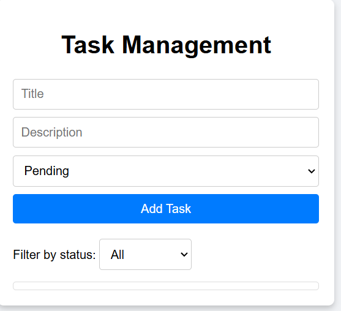
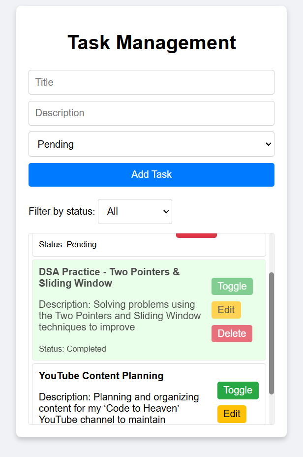
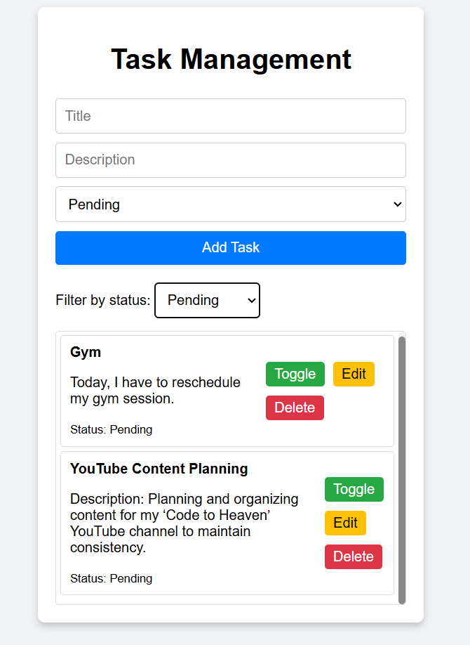

# Task Management App

A simple **Task Management App** built using **HTML, CSS, and JavaScript**. This app allows users to **add, edit, delete, toggle completion status**, and **filter tasks**.

## 🚀 Live Demo

🔗 [Task Management App](https://neelsamel23.github.io/Task_Management/)

## 📌 Features

✅ Add new tasks with a title, description, and status (Pending/Completed).\
✅ Edit tasks to modify details.\
✅ Toggle task completion status.\
✅ Delete tasks when no longer needed.\
✅ Filter tasks by status (All, Pending, Completed).\
✅ Saves tasks to **Local Storage**, so they persist even after refreshing the page.

## 📂 Project Structure

```
Task_Management/
│-- index.html
│-- style.css
│-- script.js
│-- README.md
```

## 🛠️ Technologies Used

- **HTML** - Structure of the web page.
- **CSS** - Styling and layout.
- **JavaScript** - Functionality and interaction.
- **Local Storage** - Data persistence.

## 🎯 Installation & Usage

1. **Clone the repository**:
   ```sh
   git clone https://github.com/neelsamel23/Task_Management.git
   ```
2. **Open the project folder**:
   ```sh
   cd Task_Management
   ```
3. **Run the app**: Open `index.html` in any web browser.

## 📸 Screenshots





## 📜 License

This project is **open-source** and free to use.

## 📩 Contact

📧 **Email**: neelsamel3\@gmail.com\
🐙 **GitHub**: [neelsamel23](https://github.com/neelsamel23)\
🚀 **Portfolio**: 

---

*Star ⭐ this repository if you found it useful!*

